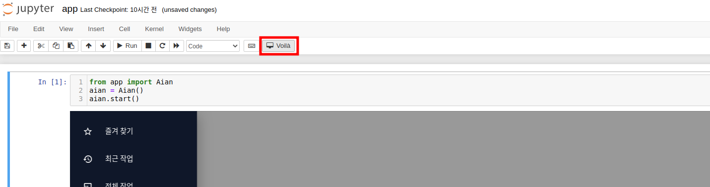

# AIDUez3.0 <span style="font-size:1.3rem; font-weight:lighter">(Last Updated: 3/28/22 - 03:30AM)</span>

## Development

- Docker Image 만들기

```console
# 소스 코드 Clone후에 도커 이미지 빌드
-$ docker build -t (image name) .  
```

- Jupyter Notebook

```console
# Container 실행
-$ docker run -itd -p 8888:8888 -v (source code path for volume mount):/opt/code/aiduez --name (container name) (image name) /bin/bash

# Container 접속 후, Jupyter Notebook 실행
-$ jupyter notebook --ip 0.0.0.0 --notebook-dir /aihub/workspace --allow-root --no-browser

# jupyter 'HomePage'에서 'AIDUez.ipynb' 실행
```
- Voila



<br>

## Production

- Dspace: Jenkins > Nexus에 이미지 생성 > AIDU repogitory 등록

- OKD Ez실행 yaml에 아래와 같이 적용

```console
source /etc/bash.bashrc && voila /aihub/workspace/AIDUez.ipynb --port 8888 --no-browser --enable_nbextensions False 
```
<br>


